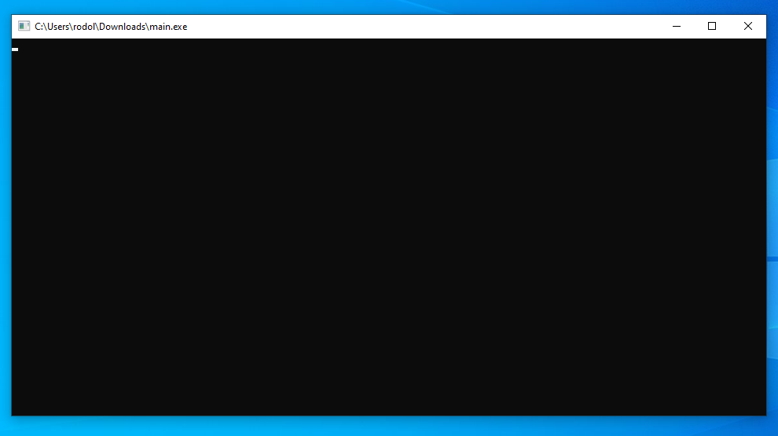
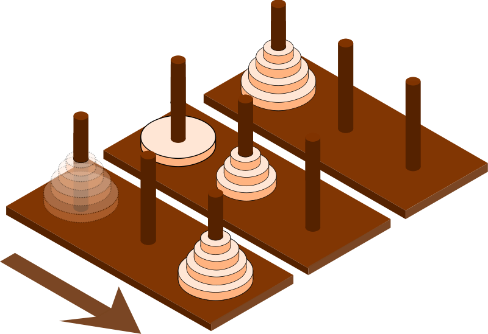

# Research
Although the sample output given by the professor clarifies that there is no need for any graphics, my first thought was [Bastet](https://snapcraft.io/install/bastet/ubuntu) (a terminal game that uses ncurses graphics). Surely is not needed, but I will implement my solution using ncurses. However, my final solution should have the option to run a simple output screen that works without ncurses (matching the professor's sample output).

I recall that using ncurses is a bit complicated for Windows, so I will start by researching ncurses and making it work on Windows. If the program doesn't work for Windows, I will not use ncurses. The most important thing is that the professor can open my program in her Windows machine (target user).

Another thing I think is important to research is the rules of and algorithms for the Towers of Hanoi.

This document has the results of my research on these topics:
- [Testing ncurses](#testing-ncurses)
- [The Towers of Hanoi](#tower-of-hanoi)

## Testing ncurses
### Testing ncurses: Installing MinGW-w64
The first step is to install [MinGW-w64](https://www.mingw-w64.org/). This setup will allow me to include and use ncurses in Windows. It will be the same setup I am going to use for development.

I installed MinGW-w64, specifically the MingW-W64-builds, from the [downloads page](https://www.mingw-w64.org/downloads/) and selected the 64-bits (86_64) version during installation. If the download fails during installation (servers down), you can get the pre-built package from the [SourceForge page](https://sourceforge.net/projects/mingw-w64/files/). I downloaded `x86_64-posix-seh`, which is the latest version to this date (March 23, 2022).


### Testing ncurses: Writing a Simple ncurses Program
After completing the installation (and adding the directory of the executables to the path environment variable), I wrote a simple ncurses program to test my setup.

```c++
#include <ncurses.h>

int main(void) {
    // Show a blank (or better black) screen.
    initscr();
    refresh();

    // Wait for user to press a key and close.
    getch();
    endwin();

    return 0;
}
```

To learn about the ncurses API, look for a tutorial elsewhere.

### Testing ncurses: Compiling
Compiling this simple program to work on Windows may be a bit tricky. The objective is to run the executable on another Windows machine. Additionally, let's make this program compatible with Linux (since ncurses is better supported there), so I will not use any OS-specific functions.

The compilation command looks like this.
```txt
g++ -o output_filename input_source_code.cpp -I path/to/headers -I other/path/if/necessary -L path/to/libs -l<libname> -static
```

Run this command in the same directory where the source files are. The `g++ -o output_filename input_source_code.cpp` should be easy to understand.
- `g++` invokes the compiler.
- `output_filename` is the name of the executable (specified with the `-o`).
- `input_source_code.cpp` is the source code. A list of files separated by spaces can be used here.

The rest of the options are more specific to what I want for my resulting executable.
- `-I` specifies the path to the header files that are included with angle brackets (`<>`). In this case, I am using this option twice. The first time will be the path to `<ncurses.h>`. The second time will be for the path to `<ncursesw/ncurses_dll.h>`, which the first header calls. The second include path may be required just for this specific setup (I got errors when not using it).
- `-L` specifies the path to external libraries (`.a` or `.dll`).
- `-l<libname>` tells the linker which library to include. `-l<name>` will link `lib<name>.a`.
- Finally, `-static` includes the libraries (statically) in the executable. This will increase the file size a bit (or bits), but it will not be necessary for the user to have extra `.lib` files.

The command will look like this for my setup. Note how I use `` ` `` to escape spaces for Windows paths.

```txt
g++ -o main main.cpp -I C:\Program` Files\mingw-w64\x86_64-8.1.0-release-posix-seh-rt_v6-rev0\mingw64\opt\include\ncursesw -I C:\Program` Files\mingw-w64\x86_64-8.1.0-release-posix-seh-rt_v6-rev0\mingw64\opt\include -L C:\Program` Files\mingw-w64\x86_64-8.1.0-release-posix-seh-rt_v6-rev0\mingw64\opt\lib -lncurses -static
```

I compiled my program and tested it on a different Windows machine. It worked without issues.



This means I can use ncurses for my solution.

## Tower of Hanoi
The Towers of Hanoi is a simple puzzle that consists of three rods and a certain number of disks. It looks like this.



The purpose is to move all the disks from one rod to the one in the other end. However, there are rules to follow.
- Only one disk may be moved at a time.
- Each move consists of taking the upper disk from one of the stacks and placing it on top of another stack or on an empty rod.
- No disk may be placed on top of a disk that is smaller than it.

(Rules taken from [Wikipedia](https://en.wikipedia.org/wiki/Tower_of_Hanoi).)

Another interesting fact is that the puzzle can be solved in 2<sup>n</sup> - 1 moves (information given in class); this is known as the optimal solution. For the 3 disks version requested by the professor, the optimal solution is in 7 moves.

Although not required, I could add an option to demonstrate the optimal solution (moves by the computer) and change the settings to work with different amounts of disks.

### Solver Algorithm
TutorialsPoint gives an [easy-to-understand explanation](https://www.tutorialspoint.com/data_structures_algorithms/tower_of_hanoi.htm) of the recursive solution to this challenge. However, I would like an iterative approach to decrease the overhead of creating function calls for a large number of disks. I found this solution from [GeeksforGeeks](https://www.geeksforgeeks.org/iterative-tower-of-hanoi/):

```txt
1. Calculate the total number of moves required i.e. "pow(2, n)
   - 1" here n is number of disks.
2. If number of disks (i.e. n) is even then interchange destination 
   pole and auxiliary pole.
3. for i = 1 to total number of moves:
     if i%3 == 1:
    legal movement of top disk between source pole and 
        destination pole
     if i%3 == 2:
    legal movement top disk between source pole and 
        auxiliary pole    
     if i%3 == 0:
        legal movement top disk between auxiliary pole 
        and destination pole 
```

Like in other explanations, the three pegs are named source (where the pile starts), destination, and auxiliary. In this algorithm, a legal movement between pegs could be in either direction. For example, the first scenario says that a legal move between the source and destination must be legal. This means that the move could be from source to destination or from destination to source. Keep this in mind for the design stage.

---

Previous: [Start](readme.md)<br />
Next: [Design](design.md)